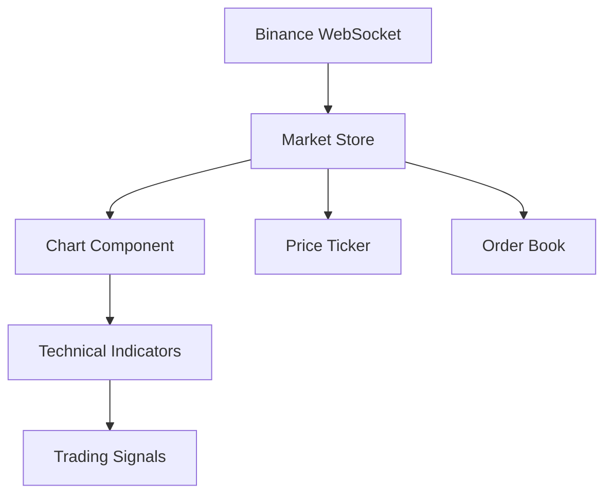
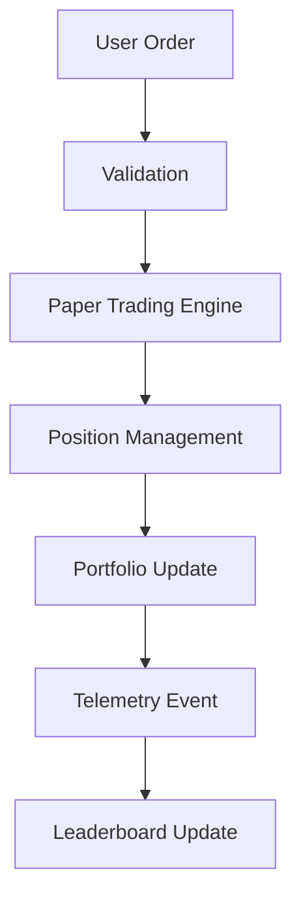
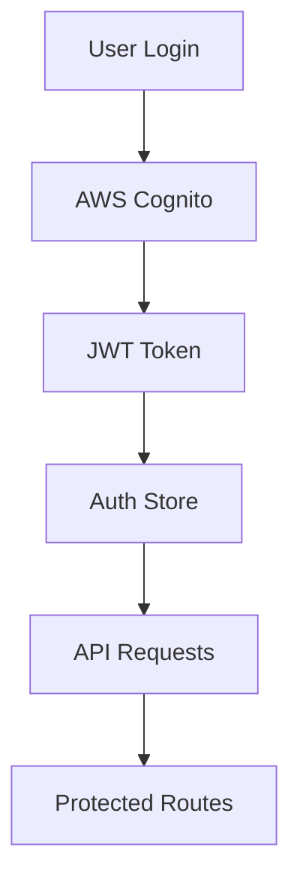
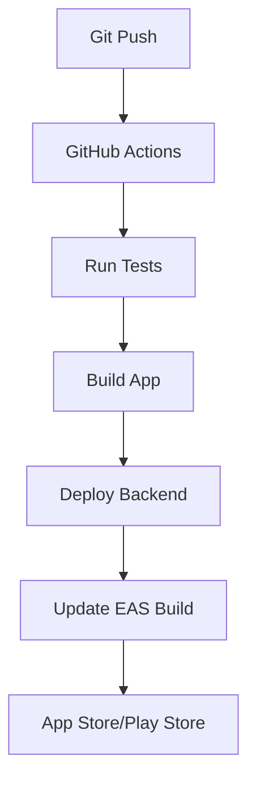

# HoundTrade - Crypto Paper Trading App Architecture

## Project Overview
HoundTrade is a React Native (Expo) crypto paper trading application with advanced charting, real-time data, and social features including global leaderboards.

## Technology Stack

### Frontend
- **Framework**: React Native with Expo SDK 54
- **Language**: TypeScript
- **State Management**: Zustand
- **UI Library**: Tamagui (theming, components)
- **Navigation**: React Navigation v6
- **Animations**: Reanimated 3 + Moti
- **Data Fetching**: React Query (TanStack Query)
- **Charts**: Custom WebGL-based candlestick charts
- **WebSocket**: Native WebSocket with reconnection logic

### Backend (AWS)
- **API Gateway**: REST endpoints + WebSocket API
- **Lambda Functions**: Serverless compute
- **DynamoDB**: NoSQL database
- **Cognito**: Authentication service
- **CloudWatch**: Logging and monitoring
- **S3**: Static assets and backups

### External APIs
- **Binance API**: Real-time price data and historical OHLCV
- **Binance WebSocket**: Live price streams

## Application Architecture

### State Management Structure
```
stores/
├── authStore.ts          # User authentication state
├── tradingStore.ts       # Trading positions, orders, balance
├── marketStore.ts        # Price data, pairs, WebSocket connections
├── portfolioStore.ts     # Portfolio performance, equity curve
├── leaderboardStore.ts   # Global rankings, user profiles
├── settingsStore.ts      # App settings, theme, telemetry
└── telemetryStore.ts     # Event tracking and analytics
```

### Screen Architecture
```
screens/
├── auth/
│   ├── LoginScreen.tsx
│   ├── SignupScreen.tsx
│   ├── ResetPasswordScreen.tsx
│   └── OnboardingScreen.tsx
├── trading/
│   ├── HomeScreen.tsx
│   ├── ChartTradeScreen.tsx
│   └── OrderHistoryScreen.tsx
├── portfolio/
│   ├── PortfolioScreen.tsx
│   └── EquityCurveScreen.tsx
├── social/
│   ├── LeaderboardScreen.tsx
│   └── ProfileScreen.tsx
└── settings/
    ├── SettingsScreen.tsx
    └── TelemetryScreen.tsx
```

## Core Features Implementation

### 1. Real-time Data Flow


### 2. Trading Engine


### 3. Authentication Flow


## Database Schema (DynamoDB)

### Users Table
```typescript
interface User {
  userId: string;           // Partition Key
  email: string;
  displayName: string;
  createdAt: string;
  settings: UserSettings;
  telemetryOptIn: boolean;
}
```

### Trades Table
```typescript
interface Trade {
  tradeId: string;          // Partition Key
  userId: string;           // GSI
  symbol: string;
  type: 'market' | 'limit';
  side: 'buy' | 'sell';
  quantity: number;
  price: number;
  executedAt: string;
  pnl: number;
  commission: number;
}
```

### Leaderboard Table
```typescript
interface LeaderboardEntry {
  userId: string;           // Partition Key
  period: string;           // Sort Key (7d, 30d, all)
  pnlPercentage: number;
  totalTrades: number;
  winRate: number;
  updatedAt: string;
}
```

### Telemetry Table
```typescript
interface TelemetryEvent {
  eventId: string;          // Partition Key
  userId: string;           // GSI
  eventType: string;
  eventData: Record<string, any>;
  timestamp: string;
  sessionId: string;
}
```

## API Endpoints

### Authentication
- `POST /auth/login` - User login
- `POST /auth/register` - User registration
- `POST /auth/refresh` - Token refresh
- `POST /auth/reset-password` - Password reset

### Trading
- `GET /trading/portfolio` - Get user portfolio
- `POST /trading/order` - Place order
- `GET /trading/orders` - Get order history
- `POST /trading/reset-account` - Reset paper account

### Market Data
- `GET /market/pairs` - Get available trading pairs
- `GET /market/ohlcv/{symbol}` - Get historical data
- `WebSocket /market/stream` - Real-time price updates

### Leaderboard
- `GET /leaderboard/{period}` - Get rankings
- `GET /profile/{userId}` - Get user profile
- `WebSocket /leaderboard/stream` - Real-time updates

### Telemetry
- `POST /telemetry/events` - Batch event logging
- `GET /telemetry/settings` - Get user preferences

## Component Architecture

### Chart Component Structure
```
components/chart/
├── CandlestickChart.tsx     # Main chart component
├── TechnicalIndicators.tsx  # MA, RSI, MACD, Bollinger
├── DrawingTools.tsx         # Lines, rectangles, fibonacci
├── OrderHandles.tsx         # TP/SL drag handles
├── TimeframeSelector.tsx    # 1m, 5m, 1h, 1d, etc.
└── ChartControls.tsx        # Zoom, pan, reset
```

### Trading Interface
```
components/trading/
├── OrderForm.tsx            # Market/limit order placement
├── AdvancedOrders.tsx       # Stop-loss, trailing, OCO
├── PositionsList.tsx        # Active positions
├── OrderBook.tsx            # Bid/ask levels
└── TradingPair.tsx          # Pair selector and info
```

## Performance Optimizations

### 1. Chart Performance
- WebGL rendering for smooth 60fps charts
- Data virtualization for large datasets
- Debounced zoom/pan operations
- Efficient indicator calculations

### 2. WebSocket Management
- Connection pooling and reconnection logic
- Message queuing during disconnections
- Selective subscription management
- Heartbeat monitoring

### 3. State Management
- Selective re-renders with Zustand
- Memoized selectors and computations
- Optimistic updates for better UX
- Background data synchronization

## Security Considerations

### 1. Authentication
- JWT token rotation
- Secure token storage (Keychain/Keystore)
- Biometric authentication support
- Session timeout management

### 2. API Security
- Rate limiting on all endpoints
- Input validation and sanitization
- CORS configuration
- API key rotation

### 3. Data Privacy
- Opt-in telemetry with clear consent
- Data anonymization for analytics
- GDPR compliance for EU users
- Secure data transmission (HTTPS/WSS)

## Development Workflow

### 1. Environment Setup
```bash
# Development
npm run start

# iOS Simulator
npm run ios

# Android Emulator
npm run android

# Web Development
npm run web
```

### 2. Testing Strategy
- Unit tests with Jest
- Component tests with React Native Testing Library
- E2E tests with Detox
- API integration tests
- Performance testing with Flipper

### 3. Deployment Pipeline


## Monitoring and Analytics

### 1. Application Monitoring
- Crash reporting with Sentry
- Performance monitoring
- User session tracking
- API response time monitoring

### 2. Business Metrics
- Daily/Monthly Active Users
- Trading volume and frequency
- Feature adoption rates
- User retention metrics

### 3. Technical Metrics
- App startup time
- Chart rendering performance
- WebSocket connection stability
- API error rates

## Future Enhancements

### Phase 2 Features
- Social trading (copy trading)
- Advanced portfolio analytics
- Custom indicator builder
- Trading bot marketplace
- Educational content integration

### Phase 3 Features
- Multi-exchange support
- Options and futures trading
- Advanced risk management
- Institutional features
- White-label solutions