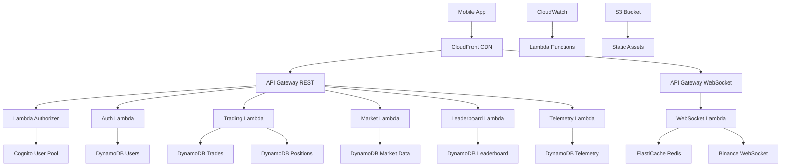

# HoundTrade Backend Infrastructure Plan

## AWS Architecture Overview



## DynamoDB Table Design

### 1. Users Table
```typescript
interface UsersTable {
  PK: string;              // USER#{userId}
  SK: string;              // PROFILE
  GSI1PK: string;          // EMAIL#{email}
  GSI1SK: string;          // USER
  
  userId: string;
  email: string;
  displayName: string;
  firstName?: string;
  lastName?: string;
  avatar?: string;
  createdAt: string;
  updatedAt: string;
  lastLoginAt: string;
  
  // Trading Settings
  defaultBalance: number;
  currentBalance: number;
  commissionRate: number;
  
  // App Settings
  theme: 'light' | 'dark' | 'auto';
  notifications: boolean;
  telemetryOptIn: boolean;
  
  // Verification Status
  emailVerified: boolean;
  phoneVerified: boolean;
  
  // Subscription Info
  subscriptionTier: 'free' | 'premium';
  subscriptionExpiry?: string;
}
```

### 2. Trades Table
```typescript
interface TradesTable {
  PK: string;              // USER#{userId}
  SK: string;              // TRADE#{timestamp}#{tradeId}
  GSI1PK: string;          // SYMBOL#{symbol}
  GSI1SK: string;          // TRADE#{timestamp}
  GSI2PK: string;          // STATUS#{status}
  GSI2SK: string;          // TRADE#{timestamp}
  
  tradeId: string;
  userId: string;
  symbol: string;
  type: 'market' | 'limit' | 'stop' | 'stop_limit';
  side: 'buy' | 'sell';
  
  // Order Details
  quantity: number;
  price: number;
  stopPrice?: number;
  executedQuantity: number;
  executedPrice: number;
  
  // Status & Timing
  status: 'pending' | 'filled' | 'cancelled' | 'rejected';
  createdAt: string;
  executedAt?: string;
  cancelledAt?: string;
  
  // Financial
  commission: number;
  pnl: number;
  
  // Advanced Orders
  takeProfitPrice?: number;
  stopLossPrice?: number;
  trailingStopPercent?: number;
  
  // Metadata
  orderSource: 'manual' | 'tp' | 'sl' | 'trailing';
  parentOrderId?: string;
}
```

### 3. Positions Table
```typescript
interface PositionsTable {
  PK: string;              // USER#{userId}
  SK: string;              // POSITION#{symbol}
  GSI1PK: string;          // SYMBOL#{symbol}
  GSI1SK: string;          // USER#{userId}
  
  userId: string;
  symbol: string;
  
  // Position Details
  quantity: number;
  averagePrice: number;
  currentPrice: number;
  
  // P&L Calculation
  unrealizedPnl: number;
  realizedPnl: number;
  totalPnl: number;
  
  // Risk Management
  takeProfitPrice?: number;
  stopLossPrice?: number;
  
  // Timestamps
  openedAt: string;
  updatedAt: string;
  closedAt?: string;
  
  // Status
  status: 'open' | 'closed';
}
```

### 4. Leaderboard Table
```typescript
interface LeaderboardTable {
  PK: string;              // LEADERBOARD#{period}
  SK: string;              // RANK#{rank:06d}#{userId}
  GSI1PK: string;          // USER#{userId}
  GSI1SK: string;          // PERIOD#{period}
  
  userId: string;
  displayName: string;
  avatar?: string;
  
  // Performance Metrics
  period: '7d' | '30d' | 'all';
  rank: number;
  pnlPercentage: number;
  totalTrades: number;
  winRate: number;
  sharpeRatio: number;
  maxDrawdown: number;
  
  // Portfolio Info
  startingBalance: number;
  currentBalance: number;
  
  // Timestamps
  calculatedAt: string;
  periodStart: string;
  periodEnd: string;
}
```

### 5. Market Data Table
```typescript
interface MarketDataTable {
  PK: string;              // SYMBOL#{symbol}
  SK: string;              // OHLCV#{timeframe}#{timestamp}
  GSI1PK: string;          // TIMEFRAME#{timeframe}
  GSI1SK: string;          // TIMESTAMP#{timestamp}
  
  symbol: string;
  timeframe: '1m' | '5m' | '15m' | '1h' | '4h' | '1d';
  timestamp: string;
  
  // OHLCV Data
  open: number;
  high: number;
  low: number;
  close: number;
  volume: number;
  
  // Additional Metrics
  trades: number;
  quoteVolume: number;
  
  // Technical Indicators (pre-calculated)
  sma20?: number;
  sma50?: number;
  ema20?: number;
  rsi?: number;
  macd?: number;
  macdSignal?: number;
  
  // Metadata
  source: 'binance' | 'coinbase' | 'kraken';
  createdAt: string;
}
```

### 6. Telemetry Table
```typescript
interface TelemetryTable {
  PK: string;              // USER#{userId}
  SK: string;              // EVENT#{timestamp}#{eventId}
  GSI1PK: string;          // EVENT_TYPE#{eventType}
  GSI1SK: string;          // TIMESTAMP#{timestamp}
  GSI2PK: string;          // SESSION#{sessionId}
  GSI2SK: string;          // TIMESTAMP#{timestamp}
  
  eventId: string;
  userId: string;
  sessionId: string;
  
  // Event Details
  eventType: string;
  eventCategory: 'navigation' | 'trading' | 'ui' | 'error' | 'performance';
  eventAction: string;
  eventLabel?: string;
  eventValue?: number;
  
  // Context Data
  screenName?: string;
  previousScreen?: string;
  userAgent?: string;
  appVersion: string;
  platform: 'ios' | 'android' | 'web';
  
  // Custom Properties
  properties: Record<string, any>;
  
  // Timestamps
  timestamp: string;
  localTimestamp: string;
  
  // Privacy
  anonymized: boolean;
  ipHash?: string;
}
```

## API Endpoints Specification

### Authentication Endpoints

#### POST /auth/register
```typescript
interface RegisterRequest {
  email: string;
  password: string;
  displayName: string;
  firstName?: string;
  lastName?: string;
  termsAccepted: boolean;
  telemetryOptIn: boolean;
}

interface RegisterResponse {
  success: boolean;
  message: string;
  userId?: string;
  verificationRequired: boolean;
}
```

#### POST /auth/login
```typescript
interface LoginRequest {
  email: string;
  password: string;
  rememberMe?: boolean;
}

interface LoginResponse {
  success: boolean;
  accessToken: string;
  refreshToken: string;
  expiresIn: number;
  user: UserProfile;
}
```

#### POST /auth/social-login
```typescript
interface SocialLoginRequest {
  provider: 'google' | 'apple';
  idToken: string;
  accessToken?: string;
}

interface SocialLoginResponse {
  success: boolean;
  accessToken: string;
  refreshToken: string;
  expiresIn: number;
  user: UserProfile;
  isNewUser: boolean;
}
```

### Trading Endpoints

#### GET /trading/portfolio
```typescript
interface PortfolioResponse {
  userId: string;
  balance: number;
  equity: number;
  unrealizedPnl: number;
  realizedPnl: number;
  totalPnl: number;
  pnlPercentage: number;
  positions: Position[];
  openOrders: Order[];
  dayChange: number;
  dayChangePercent: number;
}
```

#### POST /trading/order
```typescript
interface PlaceOrderRequest {
  symbol: string;
  type: 'market' | 'limit' | 'stop' | 'stop_limit';
  side: 'buy' | 'sell';
  quantity: number;
  price?: number;
  stopPrice?: number;
  takeProfitPrice?: number;
  stopLossPrice?: number;
  trailingStopPercent?: number;
  timeInForce?: 'GTC' | 'IOC' | 'FOK';
}

interface PlaceOrderResponse {
  success: boolean;
  orderId: string;
  status: string;
  executedQuantity: number;
  executedPrice: number;
  commission: number;
  message?: string;
}
```

#### GET /trading/orders
```typescript
interface OrderHistoryRequest {
  symbol?: string;
  status?: string;
  limit?: number;
  offset?: number;
  startDate?: string;
  endDate?: string;
}

interface OrderHistoryResponse {
  orders: Order[];
  total: number;
  hasMore: boolean;
}
```

### Market Data Endpoints

#### GET /market/pairs
```typescript
interface TradingPairsResponse {
  pairs: TradingPair[];
  categories: string[];
  featured: string[];
}

interface TradingPair {
  symbol: string;
  baseAsset: string;
  quoteAsset: string;
  status: 'TRADING' | 'BREAK' | 'HALT';
  minQuantity: number;
  maxQuantity: number;
  stepSize: number;
  tickSize: number;
  category: string;
  isMarginTradingAllowed: boolean;
}
```

#### GET /market/ticker/{symbol}
```typescript
interface TickerResponse {
  symbol: string;
  price: number;
  change24h: number;
  changePercent24h: number;
  high24h: number;
  low24h: number;
  volume24h: number;
  quoteVolume24h: number;
  trades24h: number;
  timestamp: string;
}
```

#### GET /market/ohlcv/{symbol}
```typescript
interface OHLCVRequest {
  timeframe: '1m' | '5m' | '15m' | '1h' | '4h' | '1d';
  limit?: number;
  startTime?: string;
  endTime?: string;
}

interface OHLCVResponse {
  symbol: string;
  timeframe: string;
  data: OHLCVCandle[];
}

interface OHLCVCandle {
  timestamp: string;
  open: number;
  high: number;
  low: number;
  close: number;
  volume: number;
  trades: number;
  quoteVolume: number;
}
```

### Leaderboard Endpoints

#### GET /leaderboard/{period}
```typescript
interface LeaderboardRequest {
  period: '7d' | '30d' | 'all';
  limit?: number;
  offset?: number;
}

interface LeaderboardResponse {
  period: string;
  rankings: LeaderboardEntry[];
  total: number;
  userRank?: number;
  lastUpdated: string;
}

interface LeaderboardEntry {
  rank: number;
  userId: string;
  displayName: string;
  avatar?: string;
  pnlPercentage: number;
  totalTrades: number;
  winRate: number;
  sharpeRatio: number;
  badge?: string;
}
```

#### GET /profile/{userId}
```typescript
interface UserProfileResponse {
  userId: string;
  displayName: string;
  avatar?: string;
  joinedAt: string;
  
  // Trading Stats
  totalTrades: number;
  winRate: number;
  bestTrade: number;
  worstTrade: number;
  averageHoldTime: number;
  
  // Performance by Period
  performance: {
    '7d': PerformanceMetrics;
    '30d': PerformanceMetrics;
    'all': PerformanceMetrics;
  };
  
  // Equity Curve Data
  equityCurve: EquityPoint[];
  
  // Recent Activity
  recentTrades: Trade[];
}

interface PerformanceMetrics {
  pnlPercentage: number;
  totalTrades: number;
  winRate: number;
  sharpeRatio: number;
  maxDrawdown: number;
  rank: number;
}
```

### Telemetry Endpoints

#### POST /telemetry/events
```typescript
interface TelemetryBatchRequest {
  events: TelemetryEvent[];
  sessionId: string;
  userId?: string;
  deviceInfo: DeviceInfo;
}

interface TelemetryEvent {
  eventType: string;
  eventCategory: string;
  eventAction: string;
  eventLabel?: string;
  eventValue?: number;
  properties?: Record<string, any>;
  timestamp: string;
  screenName?: string;
}

interface DeviceInfo {
  platform: 'ios' | 'android' | 'web';
  appVersion: string;
  osVersion: string;
  deviceModel: string;
  screenSize: string;
  locale: string;
  timezone: string;
}
```

## WebSocket API Specification

### Connection & Authentication
```typescript
// Connection URL: wss://api.houndtrade.com/ws
// Headers: Authorization: Bearer {accessToken}

interface WebSocketMessage {
  type: string;
  channel?: string;
  data: any;
  timestamp: string;
  requestId?: string;
}
```

### Market Data Channels

#### Price Updates
```typescript
// Subscribe: {"type": "subscribe", "channel": "ticker", "symbol": "BTCUSDT"}
interface TickerUpdate {
  type: 'ticker';
  symbol: string;
  price: number;
  change24h: number;
  changePercent24h: number;
  volume24h: number;
  timestamp: string;
}
```

#### Candlestick Updates
```typescript
// Subscribe: {"type": "subscribe", "channel": "kline", "symbol": "BTCUSDT", "timeframe": "1m"}
interface KlineUpdate {
  type: 'kline';
  symbol: string;
  timeframe: string;
  data: {
    timestamp: string;
    open: number;
    high: number;
    low: number;
    close: number;
    volume: number;
    isClosed: boolean;
  };
}
```

### Trading Channels

#### Order Updates
```typescript
// Auto-subscribed for authenticated users
interface OrderUpdate {
  type: 'order';
  orderId: string;
  status: 'filled' | 'cancelled' | 'rejected';
  executedQuantity: number;
  executedPrice: number;
  commission: number;
  timestamp: string;
}
```

#### Position Updates
```typescript
interface PositionUpdate {
  type: 'position';
  symbol: string;
  quantity: number;
  averagePrice: number;
  currentPrice: number;
  unrealizedPnl: number;
  timestamp: string;
}
```

### Leaderboard Channels

#### Ranking Updates
```typescript
// Subscribe: {"type": "subscribe", "channel": "leaderboard", "period": "7d"}
interface LeaderboardUpdate {
  type: 'leaderboard';
  period: string;
  updates: {
    userId: string;
    oldRank: number;
    newRank: number;
    pnlPercentage: number;
  }[];
  timestamp: string;
}
```

## Lambda Function Architecture

### 1. Auth Functions
```typescript
// lambdas/auth/login.ts
export const handler = async (event: APIGatewayProxyEvent) => {
  // Validate credentials with Cognito
  // Generate JWT tokens
  // Update last login timestamp
  // Return user profile and tokens
};

// lambdas/auth/register.ts
export const handler = async (event: APIGatewayProxyEvent) => {
  // Validate input data
  // Create Cognito user
  // Create DynamoDB user record
  // Send verification email
  // Return registration status
};
```

### 2. Trading Functions
```typescript
// lambdas/trading/placeOrder.ts
export const handler = async (event: APIGatewayProxyEvent) => {
  // Validate order parameters
  // Check account balance
  // Execute paper trade
  // Update positions and portfolio
  // Send WebSocket notification
  // Log telemetry event
};

// lambdas/trading/getPortfolio.ts
export const handler = async (event: APIGatewayProxyEvent) => {
  // Fetch user positions
  // Calculate unrealized P&L
  // Aggregate portfolio metrics
  // Return portfolio summary
};
```

### 3. WebSocket Functions
```typescript
// lambdas/websocket/connect.ts
export const handler = async (event: APIGatewayProxyEvent) => {
  // Authenticate connection
  // Store connection ID
  // Subscribe to default channels
};

// lambdas/websocket/message.ts
export const handler = async (event: APIGatewayProxyEvent) => {
  // Parse incoming message
  // Handle subscription requests
  // Route to appropriate handler
  // Send response if needed
};

// lambdas/websocket/disconnect.ts
export const handler = async (event: APIGatewayProxyEvent) => {
  // Clean up connection
  // Remove subscriptions
  // Update user status
};
```

## Deployment Strategy

### Infrastructure as Code
```yaml
# cloudformation/main.yml
AWSTemplateFormatVersion: '2010-09-09'
Transform: AWS::Serverless-2016-10-31

Parameters:
  Environment:
    Type: String
    AllowedValues: [dev, staging, prod]
  
Resources:
  # API Gateway
  RestApi:
    Type: AWS::ApiGateway::RestApi
    Properties:
      Name: !Sub 'houndtrade-api-${Environment}'
      
  WebSocketApi:
    Type: AWS::ApiGatewayV2::Api
    Properties:
      Name: !Sub 'houndtrade-ws-${Environment}'
      ProtocolType: WEBSOCKET
      
  # Lambda Functions
  AuthFunction:
    Type: AWS::Serverless::Function
    Properties:
      CodeUri: ../lambdas/auth/
      Handler: index.handler
      Runtime: nodejs18.x
      Environment:
        Variables:
          ENVIRONMENT: !Ref Environment
          
  # DynamoDB Tables
  UsersTable:
    Type: AWS::DynamoDB::Table
    Properties:
      TableName: !Sub 'houndtrade-users-${Environment}'
      BillingMode: PAY_PER_REQUEST
      AttributeDefinitions:
        - AttributeName: PK
          AttributeType: S
        - AttributeName: SK
          AttributeType: S
      KeySchema:
        - AttributeName: PK
          KeyType: HASH
        - AttributeName: SK
          KeyType: RANGE
```

### Deployment Scripts
```bash
#!/bin/bash
# scripts/deploy.sh

set -e

ENVIRONMENT=${1:-dev}
REGION=${2:-us-east-1}

echo "Deploying HoundTrade backend to $ENVIRONMENT..."

# Build Lambda functions
npm run build:lambdas

# Deploy CloudFormation stack
aws cloudformation deploy \
  --template-file infrastructure/cloudformation/main.yml \
  --stack-name houndtrade-$ENVIRONMENT \
  --parameter-overrides Environment=$ENVIRONMENT \
  --capabilities CAPABILITY_IAM \
  --region $REGION

# Update API Gateway stages
aws apigateway create-deployment \
  --rest-api-id $(aws cloudformation describe-stacks \
    --stack-name houndtrade-$ENVIRONMENT \
    --query 'Stacks[0].Outputs[?OutputKey==`RestApiId`].OutputValue' \
    --output text) \
  --stage-name $ENVIRONMENT

echo "Deployment completed successfully!"
```

This comprehensive backend plan provides the foundation for a scalable, real-time crypto trading platform with proper data modeling, API design, and AWS infrastructure setup.